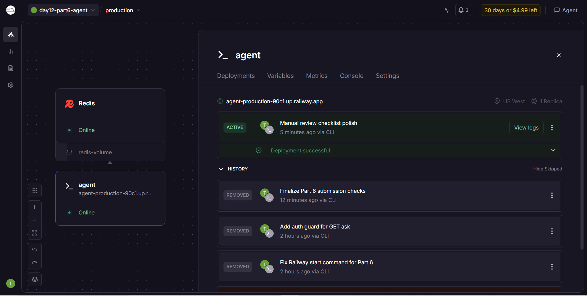

# Deployment Information

## Public URL

```text
https://agent-production-90c1.up.railway.app
```

## Platform

- Railway project: `day12-part6-agent`
- Railway services: `agent` and `Redis`
- Deployment status: `SUCCESS`

## Test Commands

### Health Check

```bash
curl https://agent-production-90c1.up.railway.app/health
```

Verified output:

```json
{"status":"ok","version":"1.0.0","environment":"production","uptime_seconds":49.7,"total_requests":1,"timestamp":"2026-06-12T12:48:59.609009+00:00"}
```

### Readiness Check

```bash
curl https://agent-production-90c1.up.railway.app/ready
```

Verified output:

```json
{"ready":true,"redis":"ok","in_flight_requests":2}
```

### Authentication Required

```bash
curl https://agent-production-90c1.up.railway.app/ask
```

Verified output: `401 Unauthorized`

### API Test

```bash
curl -X POST https://agent-production-90c1.up.railway.app/ask \
  -H "X-API-Key: $AGENT_API_KEY" \
  -H "Content-Type: application/json" \
  -d '{"user_id":"remote-test-2","question":"My name is Dat"}'
```

Verified output:

```json
{"user_id":"remote-test-2","question":"My name is Dat","answer":"Tôi là AI agent được deploy lên cloud. Câu hỏi của bạn đã được nhận.","model":"gpt-4o-mini","timestamp":"2026-06-12T12:49:38.944908+00:00"}
```

### Conversation History Test

```bash
curl -X POST https://agent-production-90c1.up.railway.app/ask \
  -H "X-API-Key: $AGENT_API_KEY" \
  -H "Content-Type: application/json" \
  -d '{"user_id":"remote-test-2","question":"What did I just say?"}'
```

Verified output:

```json
{"user_id":"remote-test-2","question":"What did I just say?","answer":"You just said: My name is Dat","model":"gpt-4o-mini","timestamp":"2026-06-12T12:49:39.414355+00:00"}
```

### Rate Limit Test

```bash
for i in {1..15}; do
  curl -X POST https://agent-production-90c1.up.railway.app/ask \
    -H "X-API-Key: $AGENT_API_KEY" \
    -H "Content-Type: application/json" \
    -d '{"user_id":"rate-test","question":"test"}'
done
```

Local Docker verification returned:

```text
rate_statuses: [200, 200, 200, 200, 200, 200, 200, 200, 200, 200, 429, 429, 429, 429, 429]
```

## Environment Variables Set

- `PORT=8000`
- `REDIS_URL=${{Redis.REDIS_URL}}`
- `AGENT_API_KEY`
- `RATE_LIMIT_PER_MINUTE=10`
- `MONTHLY_BUDGET_USD=10`
- `ENVIRONMENT=production`
- `LOG_LEVEL=INFO`
- `ALLOWED_ORIGINS=*`

## Local Production Verification

```bash
cd 06-lab-complete
python check_production_ready.py
docker compose up -d --build
curl http://localhost:8000/health
curl http://localhost:8000/ready
```

Scale test:

```bash
docker compose up -d --scale agent=3
docker compose ps
```

Verified scale/stateless output:

```text
health 18000 200
health 18001 200
health 18002 200
write -> 200
read  -> 200, "You just said: My name is Dat"
```

Verified:

```text
Production readiness: 20/20 checks passed (100%)
Docker image size: 307MB
```

## Screenshot

Screenshot required only for the cloud deployment dashboard:

