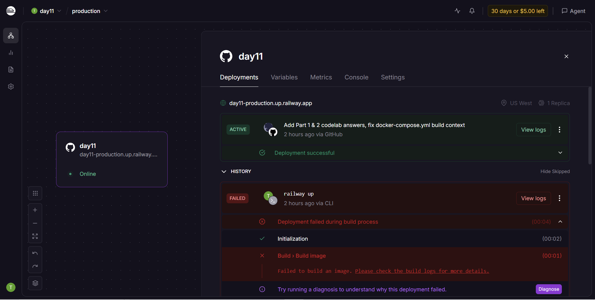

# Day 12 Lab - Mission Answers

> **Student Name:** Do Tuan Dat  
> **Student ID:** 2A202600818  
> **Date:** 12/06/2026

---

## Part 1: Localhost vs Production

### Exercise 1.1: Anti-patterns found

Trong bản develop của ứng dụng local, các anti-pattern chính gồm:

1. Hardcoded API key hoặc secret trong source code.
2. Port bị hardcode, không đọc từ biến môi trường `PORT`.
3. Debug/development behavior chưa phù hợp production.
4. Thiếu health check endpoint để platform biết app còn sống hay không.
5. Thiếu readiness check để biết app đã sẵn sàng nhận traffic hay chưa.
6. Logging còn đơn giản, có nguy cơ log thông tin nhạy cảm.
7. Thiếu graceful shutdown, dễ làm request bị cắt ngang khi deploy hoặc scale down.
8. Host binding kiểu `localhost` không phù hợp khi chạy trong container/cloud.

### Exercise 1.2: Run basic version

Đã chạy thử bản basic bằng FastAPI `TestClient`.

Kết quả:

```text
GET / -> 200 {'message': 'Hello! Agent is running on my machine :)'}
[DEBUG] Got question: Hello
[DEBUG] Using key: sk-hardcoded-fake-key-never-do-this
[DEBUG] Response: Agent đang hoạt động tốt! (mock response) Hỏi thêm câu hỏi đi nhé.
POST /ask?question=Hello -> 200 {'answer': 'Agent đang hoạt động tốt! (mock response) Hỏi thêm câu hỏi đi nhé....'}
GET /health -> 404
```

Nhận xét: app basic trả lời được câu hỏi, nhưng đúng như phần anti-pattern đã nêu, nó log secret ra stdout và không có `/health`.

### Exercise 1.3: Comparison table

| Feature | Develop | Production | Why Important? |
|---------|---------|------------|----------------|
| Config | Hardcode trong code | Đọc từ environment variables và settings object | Deploy cloud cần thay đổi config mà không sửa source; tránh lộ secret |
| Health check | Không có hoặc rất tối thiểu | Có `/health` và `/ready` | Platform dùng để restart app hoặc route traffic đúng lúc |
| Logging | `print()` đơn giản | Structured logging | Dễ đọc trên cloud logs và dễ tích hợp monitoring |
| Shutdown | Process bị kill đột ngột | Graceful shutdown qua lifespan/signal | Request đang chạy có thời gian hoàn thành |
| Host binding | `localhost` | `0.0.0.0` | Container cần nhận kết nối từ bên ngoài container |
| Port | Hardcode `8000` | Đọc từ `PORT` | Railway/Render/Cloud Run inject port tự động |

---

## Part 2: Docker

### Exercise 2.1: Dockerfile questions

1. **Base image:** `python:3.11` trong Dockerfile develop; production dùng `python:3.11-slim`.
2. **Working directory:** `/app`.
3. **Tại sao copy `requirements.txt` trước?** Để tận dụng Docker layer cache. Khi chỉ thay đổi source code mà dependencies không đổi, Docker không cần chạy lại bước `pip install`.
4. **CMD vs ENTRYPOINT:** `CMD` là command mặc định có thể override khi `docker run`; `ENTRYPOINT` là command chính cố định hơn. Lab dùng `CMD` để chạy app linh hoạt.

### Exercise 2.2: Basic build and run result

Kết quả build/run develop:

- Image: `my-agent:develop`
- Size thực tế ghi nhận: **1.66 GB** disk usage / khoảng **424 MB** content
- Container chạy tại `http://localhost:8000`
- Health check trả về:

```json
{"status":"ok","container":true}
```

### Exercise 2.3: Image size comparison

| Image | Size |
|-------|------|
| `my-agent:develop` | 1.66 GB |
| `my-agent:advanced` | 236 MB |

Production image nhỏ hơn khoảng **7 lần** nhờ multi-stage build và base image `python:3.11-slim`.

### Exercise 2.4: Docker Compose architecture

Docker Compose stack gồm:

- `agent`: FastAPI AI agent.
- `redis`: cache/session/rate-limit store.
- `qdrant`: vector database cho RAG.
- `nginx`: reverse proxy/load balancer, expose port public.

Luồng request:

```text
Client -> Nginx (:80) -> agent (:8000)
                       -> Redis (:6379)
                       -> Qdrant (:6333)
```

Kết quả test ghi nhận:

```json
GET /health -> {"status":"ok","uptime_seconds":14.7,"version":"2.0.0"}
```

---

## Part 3: Cloud Deployment

### Exercise 3.1: Railway deployment

- Platform: Railway
- Public URL: https://day11-production.up.railway.app/
- Health endpoint: https://day11-production.up.railway.app/health

Test command:

```bash
curl https://day11-production.up.railway.app/health
```

Kết quả test thực tế:

```json
{
  "status": "ok",
  "uptime_seconds": 6668.4,
  "platform": "Railway",
  "timestamp": "2026-06-12T10:16:35.532949+00:00"
}
```

API test command:

```bash
curl -X POST https://day11-production.up.railway.app/ask \
  -H "Content-Type: application/json" \
  -d '{"question": "test"}'
```

Kết quả test thực tế:

```json
{
  "question": "test",
  "answer": "Agent đang hoạt động tốt! (mock response) Hỏi thêm câu hỏi đi nhé.",
  "platform": "Railway"
}
```

> **Screenshot dashboard deploy cloud:** 
### Exercise 3.2: Render vs Railway config

| Đặc trưng | `render.yaml` | `railway.toml` |
|----------|---------------|----------------|
| Mục đích | Infrastructure as Code cho Render Blueprint | Cấu hình service Railway |
| Phạm vi | Có thể định nghĩa nhiều service/resource | Thường tập trung vào một service |
| Environment variables | Có thể khai báo trong blueprint, một số giá trị có thể generate | Thường set qua Railway CLI/Dashboard |
| Health check | Khai báo `healthCheckPath` trong service | Khai báo `healthcheckPath` |
| Phù hợp | Stack có nhiều service, GitOps rõ ràng | Prototype/deploy nhanh |

### Exercise 3.3: GCP Cloud Run CI/CD

`cloudbuild.yaml` mô tả pipeline:

1. Cài dependencies và chạy test.
2. Build Docker image.
3. Push image lên registry.
4. Deploy image lên Cloud Run.

`service.yaml` mô tả runtime Cloud Run:

- Autoscaling min/max instances.
- CPU/memory limits.
- Environment variables và secrets.
- Liveness/startup probes.
- Concurrency per instance.


---

## Part 4: API Security

### Exercise 4.1: API Key authentication

API key được kiểm tra trong dependency `verify_api_key()` bằng header:

```http
X-API-Key: <your-key>
```

Kết quả mong đợi:

| Case | Expected |
|------|----------|
| Không có API key | `401 Unauthorized` |
| Sai API key | `403 Forbidden` |
| Đúng API key | `200 OK` |

Rotate key bằng cách đổi environment variable `AGENT_API_KEY` rồi restart/redeploy service.

Test output thực tế:

```text
PART 4.1 - 04-api-gateway/develop
no key: POST /ask?question=Hello -> 401 {'detail': 'Missing API key. Include header: X-API-Key: <your-key>'}
wrong key: POST /ask?question=Hello -> 403 {'detail': 'Invalid API key.'}
valid key: POST /ask?question=Hello -> 200 {'question': 'Hello', 'answer': 'Agent đang hoạt động tốt! (mock response) Hỏi thêm câu hỏi đi nhé....'}
```

### Exercise 4.2: JWT authentication

JWT flow:

1. Client gửi username/password tới `/token` hoặc `/auth/token`.
2. Server xác thực user.
3. Server ký JWT bằng `JWT_SECRET`.
4. Client gọi protected endpoint với header `Authorization: Bearer <token>`.
5. Server verify signature và expiry, sau đó extract `username` và `role`.

Test result ghi nhận:

```text
POST /auth/token -> 200
POST /ask without token -> 401 {'detail': 'Authentication required. Include: Authorization: Bearer <token>'}
POST /ask with token -> 200 {'question': 'Explain JWT', 'answer': 'Đây là câu trả lời từ AI agent (mock). Trong production, đây sẽ là res...', 'usage': {'requests_remaining': 9, 'budget_remaining_usd': 2.1e-05}}
```

### Exercise 4.3: Rate limiting

Algorithm được dùng: **Sliding Window Counter** với `deque` timestamps cho từng user.

Limits:

- User thường: `10 requests/phút`
- Admin: `100 requests/phút`

Khi vượt limit, API trả:

```text
429 Too Many Requests
```

Headers gồm `Retry-After`, `X-RateLimit-Limit`, `X-RateLimit-Remaining`, `X-RateLimit-Reset`.

Test result đã chạy:

```text
next 10 authenticated requests -> [200, 200, 200, 200, 200, 200, 200, 200, 200, 429]
```

### Exercise 4.4: Cost guard implementation

Cách làm:

- Mỗi user có budget `$10/tháng`.
- Spending được track theo tháng bằng key dạng `budget:{user_id}:{YYYY-MM}`.
- Khi request mới có `current_spending + estimated_cost > budget`, API block request.
- Reset budget bằng cách dùng key theo tháng và TTL qua tháng kế tiếp.
- Redis là storage phù hợp vì nhiều instances cùng đọc/ghi được.

Pseudo-code:

```python
month_key = datetime.now().strftime("%Y-%m")
key = f"budget:{user_id}:{month_key}"
current = float(redis.get(key) or 0)

if current + estimated_cost > 10:
    return False

redis.incrbyfloat(key, estimated_cost)
redis.expire(key, 32 * 24 * 3600)
return True
```

---

## Part 5: Scaling & Reliability

### Exercise 5.1: Health and readiness checks

Đã implement trong `05-scaling-reliability/develop/app.py`:

- `/health`: liveness probe, trả thông tin process còn sống như `status`, `uptime_seconds`, `version`, `environment`, `timestamp`.
- `/ready`: readiness probe, trả `200` khi `_is_ready=True`; trả `503` khi app đang startup hoặc shutdown.
- `/ready` có `in_flight_requests` để quan sát request đang xử lý.

Kết quả test nhanh:

```text
health 200
ready 200
```

### Exercise 5.2: Graceful shutdown

Đã implement:

- Dùng FastAPI `lifespan` cho startup/shutdown.
- Middleware `track_requests` đếm `_in_flight_requests`.
- Khi nhận `SIGTERM`/`SIGINT`, app set `_is_ready=False` và `_is_shutting_down=True`.
- `/ready` trả `503` để load balancer ngừng route request mới.
- App chờ request đang chạy hoàn thành tối đa 30 giây.
- `uvicorn.run(..., timeout_graceful_shutdown=30)` bật graceful shutdown.

Kết quả test nhanh:

```text
Trước signal: /health 200, /ready 200, /ask 200
Sau SIGTERM: /ready 503, /ask 503
```

### Exercise 5.3: Stateless design

Đã có trong `05-scaling-reliability/production/app.py`:

- Không lưu conversation history trong biến global.
- Session được lưu qua `save_session()` và đọc qua `load_session()`.
- Khi có Redis, session lưu bằng key `session:{session_id}` với TTL.
- Endpoint `/chat` trả `served_by` để biết instance nào xử lý request.

Vì state nằm trong Redis, request sau có thể vào instance khác mà vẫn đọc được conversation history.

### Exercise 5.4: Load balancing

Đã cấu hình trong `05-scaling-reliability/production`:

- `docker-compose.yml` có `agent`, `redis`, `nginx`.
- `nginx.conf` định nghĩa `upstream agent_cluster` trỏ tới `agent:8000`.
- Chạy scale:

```bash
docker compose up -d --build --scale agent=3
```

Kết quả stack:

```text
scaling-reliability-agent-1   healthy
scaling-reliability-agent-2   healthy
scaling-reliability-agent-3   healthy
scaling-reliability-nginx-1   http://localhost:8080
scaling-reliability-redis-1   healthy
```

### Exercise 5.5: Test stateless

Đã chạy:

```bash
python test_stateless.py
```

Kết quả:

```text
Total requests: 5
Instances used: {'instance-d01aa6', 'instance-8f2c39', 'instance-5d0996'}
All requests served despite different instances
Total messages: 10
Session history preserved across all instances via Redis
```

Kết luận: stateless design hoạt động đúng. Requests được phân phối qua nhiều instances, nhưng conversation history vẫn được giữ trong Redis.

---

## Notes Before Submission

- Public deployment URL đã điền ở Part 3 và đã test `/health`, `/ask` thành công.
- Không commit file `.env`; chỉ commit `.env.example`.
- Chỉ cần giữ screenshot dashboard deploy cloud nếu giảng viên yêu cầu minh chứng triển khai.
- Trước khi nộp, chạy lại:

```bash
python 06-lab-complete/check_production_ready.py
```
